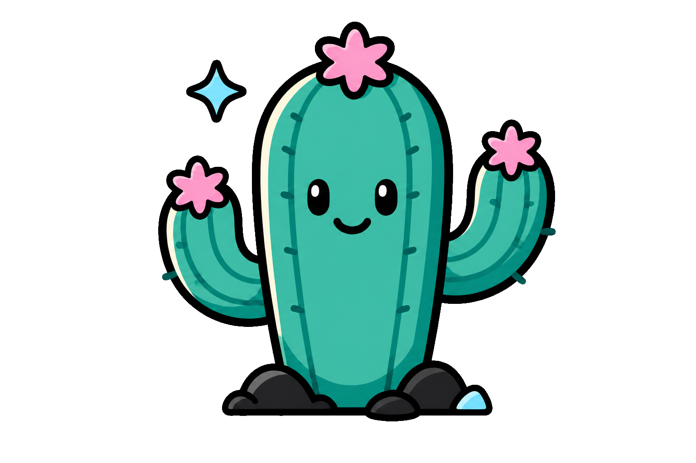

# Cactus

<p align="center">
  
</p>

[](https://hex.pm/packages/cactus)
[](https://hexdocs.pm/cactus/)
[](https://github.com/bwireman/cactus/blob/main/LICENSE)
[](https://gleam.run/news/v0.16-gleam-compiles-to-javascript/)
[](https://gleam.run)

A tool for managing git lifecycle hooks with ✨ gleam! Pre commit, Pre push and
more!

# Install

```sh
gleam add --dev cactus
```

#### Javascript

Bun, Deno & Nodejs are _all_ supported!

### 🎥 Obligatory VHS


# ▶️ Usage

**_FIRST_** configure hooks in `gleam.toml`, then initialize them:

```sh
# Erlang target
gleam run --target erlang -m cactus

# JavaScript target (pick one runtime)
gleam run --target javascript --runtime nodejs -m cactus
gleam run --target javascript --runtime bun -m cactus
gleam run --target javascript --runtime deno -m cactus
```

The `--target` and `--runtime` flags you pass here are **baked into** the
generated hook scripts under `.git/hooks/`. Use the same target/runtime your
project builds with, since hooks invoke `gleam run -m cactus -- <hook-name>`.

### CLI commands

| Command          | Description                                                  |
| ---------------- | ------------------------------------------------------------ |
| `init` (default) | Initialize hooks for the current OS (`gleam` vs `gleam.exe`) |
| `unix-init`      | Force Unix-style hook scripts                                |
| `windows-init`   | Force Windows-style hook scripts (`gleam.exe`)               |
| `help`           | Show usage                                                   |
| `clean`          | Remove cactus-generated hook scripts from `.git/hooks/`      |
| `<hook-name>`    | Run a hook's actions (e.g. `pre-commit`)                     |

Pass global flags before the command:

```sh
gleam run -m cactus -- --verbose --dry-run init
gleam run -m cactus -- --config path/to/gleam.toml init
```

### Config

Settings that can be added to your project's `gleam.toml`:

```toml
[cactus]
# Re-initialize hooks on every hook run (default: false)
always_init = false

[cactus.pre-commit]
# Default files_scope for all actions in this hook (default: "all")
files_scope = "staged"
# stop on first failure (default) or run all actions and fail at end
on_failure = "stop"
# Skip all actions in this hook when CI=true
skip_if = "ci"

actions = [
    # command: required — binary path, gleam module, or gleam subcommand name
    # kind: "module" (default), "sub_command", or "binary"
    # args: extra arguments (default: [])
    # files: paths/extensions/globs that trigger the action (default: [] = always run)
    # files_scope: "staged" | "all" | "unstaged" — overrides hook default
    # cwd: working directory for the action (default: project root)
    # skip_if: "ci" — skip this action when CI=true or CI=1
    # skip_env: "SKIP_HOOKS=1" — skip when env var is set to that value
    # env: { KEY = "value" } — extra environment variables

    { command = "format", kind = "sub_command", args = ["--check"], files = [".gleam"], files_scope = "staged" },
    { command = "./scripts/test.sh", kind = "binary" },
    { command = "go_over", kind = "module" },
]
```

#### `files` filter

An action runs when **any** watched pattern matches **any** file in the chosen
`files_scope`:

- **Extension suffixes** — entries starting with `.` (e.g. `.gleam` matches
  `src/foo.gleam`)
- **Exact paths** — e.g. `src/foo.gleam` or `./src/foo.gleam`
- **Glob patterns** — e.g. `src/**/*.gleam` (see limitations in
  [CHANGELOG](CHANGELOG.md))

An empty `files` list means the action always runs.

#### `files_scope`

| Value      | Git commands used                                 |
| ---------- | ------------------------------------------------- |
| `staged`   | `git diff --cached --name-only`                   |
| `unstaged` | `git diff --name-only` + untracked files          |
| `all`      | union of staged and unstaged (default when unset) |

For pre-commit hooks, `files_scope = "staged"` is recommended so linters only
run when relevant staged files change.

#### Pre-commit stash behavior

The `pre-commit` hook stashes unstaged and untracked changes before running
actions, then restores them afterward. This keeps formatters/linters from seeing
dirty working-tree state.

- Stashes are tagged with the message `cactus-pre-commit`
- Only cactus-tagged stashes are popped automatically
- If you already have unrelated stashes, cactus will not stash (actions may see
  unstaged changes) — commit or stash manually first

#### Supported hooks

**Client-side** (typical local use):

`applypatch-msg`, `commit-msg`, `post-checkout`, `post-commit`, `post-merge`,
`post-rewrite`, `pre-applypatch`, `pre-auto-gc`, `pre-commit`,
`pre-merge-commit`, `prepare-commit-msg`, `pre-push`, `pre-rebase`, `test`

**Server-side** (remote/git server — rarely needed locally):

`fsmonitor-watchman`, `post-update`, `pre-receive`, `push-to-checkout`, `update`

### Windows

Git hook scripts are shell scripts (`#!/bin/sh`). On Windows they require **Git
Bash** or another sh-compatible environment bundled with Git for Windows. Native
cmd/PowerShell hooks are not generated.

Use `windows-init` or let `init` detect the platform to write `gleam.exe` in
hook scripts.

# Troubleshooting

| Problem                             | Fix                                                                                               |
| ----------------------------------- | ------------------------------------------------------------------------------------------------- |
| Hooks not running                   | Run `gleam run -m cactus` from project root; ensure `.git/hooks/<name>` exists and is executable  |
| Wrong gleam/runtime in hook         | Re-run init with correct `--target` and `--runtime`; choices are embedded in hook scripts         |
| Action skipped unexpectedly         | Check `files`, `files_scope`, and `skip_if` / `skip_env`; use `--verbose`                         |
| Stash pop conflict after pre-commit | Run `git stash list`, resolve conflicts, `git stash drop` the `cactus-pre-commit` entry if needed |
| Not in a git repo                   | Initialize git first: `git init`                                                                  |
| `--config` path not found           | Pass absolute or relative path to a valid `gleam.toml`                                            |
| Stash not restored after pre-commit | Check `git stash list`; cactus errors if the top stash is not `cactus-pre-commit`                 |
